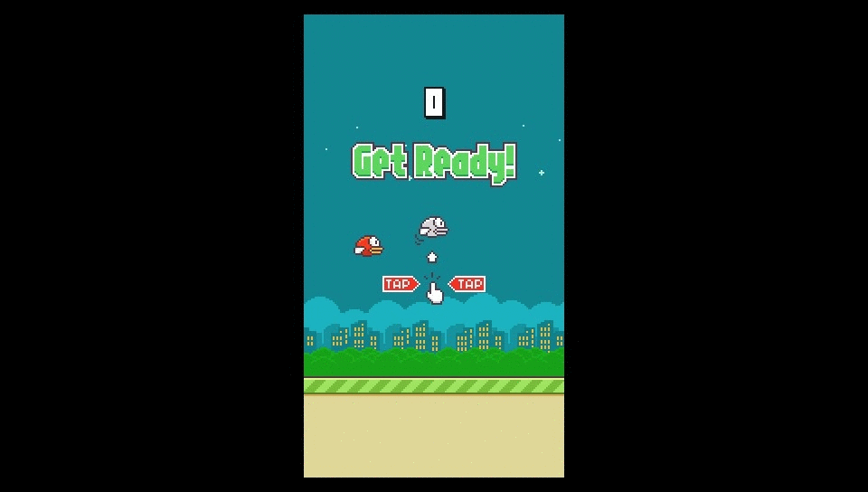

## Features
* Saves
* Good time
## How to play
* <kbd>Cross or Tap</kbd> - Jump?
## Building
Just build it by typping `cmake .&& make`
## About save
Save file is located in `ux0:data\flappy_bird.save` you can simply edit it 
Here is template : `record` <b>Do not make extra spaces</b> 
Here is example : `2048` score ceil number 
To reset saves just delete *.save file
